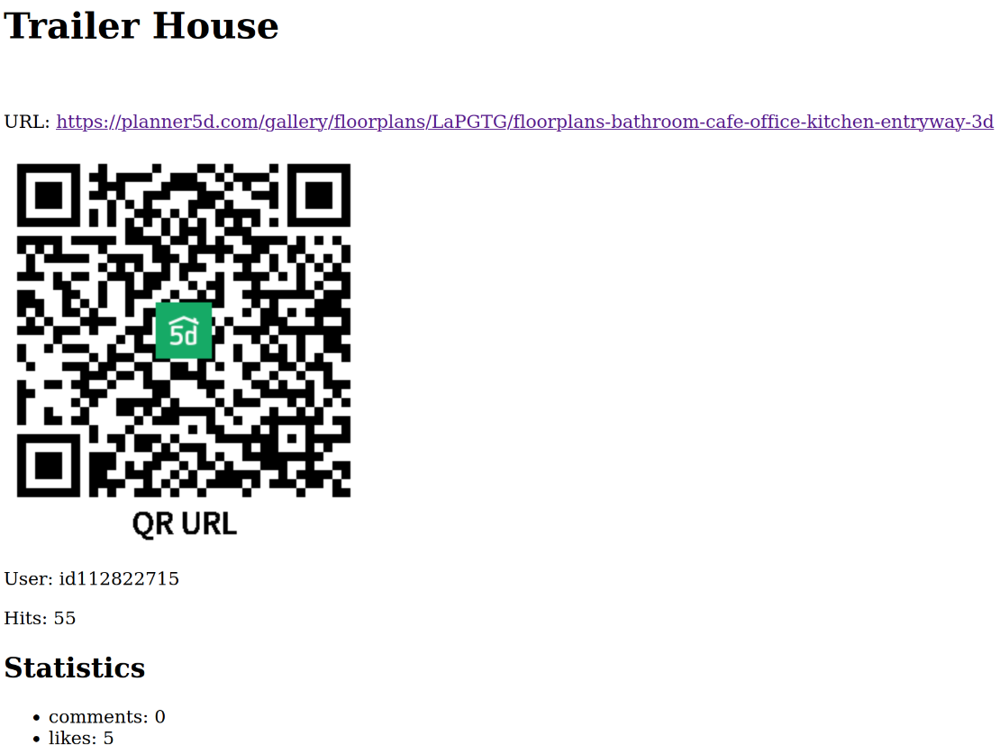

# Project scraper with Preview

## Table of Contents

- [Description](#description)
  - [Strategy](#strategy)
    - [Structure design](#design-and-principles)
  - [Features](#features)
  - [Improvements](#possible-improvements)
- [Infrastructure](#infrastructure-used)
  - [Symfony Packages](#installed-symfony-packages)
- [Getting Started](#getting-started)
  - [Run using composer (recommended)](#run-using-composer-recommended)
  - [Run using docker](#run-using-docker)
    - [Next steps](#important)
- [How it works?](#how-it-works)
  - [UI](#UI)
  - [PHPUnit Testing](#phpunit-testing)
  - [xDebug](#xdebug-debugger)
  - [Docker client host](#__client_host__-)
- [Troubleshooting](#troubleshooting)

## Description
Symfony mini-application that imports projects from a gallery and previews them.

***

### Strategy
Endpoints implementation with Controllers that call Services for the UI preview.
The project includes a command scraper (*GalleryScraperCommand*) that reads data from a target website URL, transforms the data, and persists it in a database, following an ETL (Extract, Transform, Load) process.
This command should be added to a `cron` to enable automated data updates.

#### Design and Principles
The project structure follows the **hexagonal architecture** of Application, Domain, and Infrastructure.

Design patterns used:
- Dependency Injection (*projectService*)
- Entities (*Project, ProjectStatistic*)
- Repository (*ProjectRepositoryDoctrineAdapter*)
- Exception Handling (*InvalidArgumentException*)
- Interfaces contract that allows easy implementation substitution (*CommonRepositoryInterface*)

Design principles used:
- Single Responsibility principle (SRP)
- Dependency Inversion (DI)
- DRY

### Features
The following key features are implemented
#### QR image in the Detail view
* 

#### Project
* The project is prepared to manage that a Project can have (1:N) multiple Statistics (or other Items), because of the ArrayCollection implementation.
* The scraper command accepts args to *sort* the results by type, and *limit* the number of pages to read.
  By default, it will sort by `trendy` and read `3` pages with no args.

#### Good practices
* Manual logging and Exceptions catching during the service and controller process.
* Log critical exceptions, like code errors, and return generic response messages like 'Something went wrong' to the UI client to not provide details.

#### Logic
* Persist data only if doesn't exist, update fields if it does while executing the scraper command. This allows us to update the statistics like hits, likes, and comments...
* Adapters and Ports. Change of stack easily by only adapting the Infrastructure layer.
  * Exception are the *DoctrineRepositories* for MySQL databases, they were injected directly so the extended EntityService queries like `find` could be used.
  * These repositories implement the interfaces for their expected operations: save, update, delete...

#### Performance
* It takes an average of 30 seconds to process a target gallery page with the command.

### Possible improvements
* Create a proper ResponseHandler for Error Responses.
* Some **constants** defined should be retrieved from the cache system, database, or the `.env`, so they would be easier to set on demand.
* Add individual DTO objects for the Entities and their transformation, so they can be merged with any desired resourced response.
* The URL field was added as a UNIQUE key in the projects table. There is a 6-character string within the project URL that should be used for these purposes such as finding a project by its UNIQUE URL (not the full one).

***

## Infrastructure used
* Symfony 6.4
* Docker
  * PHP 8.3 (w/ opcache & [xDebug](#xdebug-debugger))
  * Nginx
  * MariaDB 11.1.4
  * Adminer (optional)

### Installed Symfony Packages
* **phpunit/phpunit**: testing framework for PHP
* **doctrine/orm**: simplifies database interactions by mapping database tables to PHP objects.
* **doctrine/doctrine-fixtures-bundle**: predefined sets of data used for testing or populating a database with initial data.
* **symfony/http-client**: HTTP client for making HTTP requests and interacting with web services.
* **symfony/validator**: tools for validating data according to predefined rules.
* **symfony/maker-bundle**: facilitates rapid development by automating the creation of boilerplate code.
* **phpstan/phpstan**: analysis tool for PHP code, to detect and fix issues,
* **symfony/twig-bundle**: integrates the Twig templating engine into Symfony applications.
* **endroid/qr-code**: PHP library for generating QR codes with various options and formats.

***

## Getting Started
Copy or rename the `.env.dist` files (for docker and symfony) to an environment variable file and edit the entries to your needs:
```
cp ./app/.env.dist ./app/.env && cp .env.dist .env
```

### Run using composer (recommended)

`composer run` commands are provided as **shortcuts**.

1. Use `composer run setup` to start and initialize all needed containers.

2. Use `composer run import-projects` to import projects.

Available commands are:
```
composer run [
    setup             --- Build the docker images and run the containers in the background.
    build             --- Build the docker images.
    up                --- Run the containers in the background.
    down              --- Stop the containers.
    logs              --- Show container sys logs (php-fpm, nginx, and MariaDB).
    cache-clear       --- Execute Symfony clear cache command.
    stan              --- Execute PHPStan analyse command.
    test              --- Execute PHPUnit test cases.
    import-projects   --- Execute Project Gallery Scrap from 5d. Args: sort and limit (type and pages)
]
```

A folder named `var` will be created in the project root folder upon the first run. This folder includes the database files and server logs to provide help while developing.

### Run using docker
Alternatively to the use of `composer`, you can directly build & run the app by using the following docker commands:

* Use `docker compose` to start your environment.
  * Add the _param_ `up -d` if you wish to run the process in the background.
  * Add the _param_ `up --build` the **first time** to build the images.
  * Add the _keyword_ `down` to stop the containers.
```
# Build & up. From the project's root folder exec
docker compose up -d --build
```

#### IMPORTANT
After booting the container, run `composer install` from inside the container (this will avoid writing logs errors).
```
docker exec -t php-fpm composer install
```
Then run the database migrations to create the MySQL structure for the  **dev** environment.
```
docker exec -t php-fpm php bin/console doctrine:migrations:migrate --env=dev --no-interaction
```

##### OPTIONAL
After booting the container, you can use this command to enter inside it and execute commands (the container's name is defined in the _**docker-compose.yml**_ file):
```
docker exec -it $container_name bash
```
or identify the name of it displayed under the column `NAMES` of this command output:
```
docker ps
```
There's an alias being created upon the build process, and it will allow you to execute the Symfony command directly only with `sf`. Example:
```
sf debug:router
```

## How it works?
You have up to 4 containers running depending on whether you choose to use: php-fpm + nginx, MariaDB, and optionally, adminer.
Check the running containers by using the command: ``docker ps``
- [Symfony Web-App welcome page](http://localhost:80)
- [Adminer [optional] (simple database manager)](http://localhost:8080)

#### UI
Use a web browser to preview the project lists and details.

The list of available endpoints can be shown by executing (target **php-fpm**):
```
docker exec php-fpm php bin/console debug:router
```
Provided endpoints are:
```
  Name                      Method    Path                         
 ------------------------- --------  ----------------------------- 
   
  app_project_list               GET     /projects                   
  app_project_detail        GET      /project/{projectId}    
```

#### PHPUnit Testing
Additionally, run all the tests available using (target **php-fpm**):
```
docker exec php-fpm ./vendor/bin/phpunit --verbose
```
or
```
composer test
```

***

#### xDebug debugger
xDebug (the last version) is installed and ready to use. Check the config params in `/docker/extras/xdebug.ini`
By default, these are the main critical parameters provided:
+ [mode](https://xdebug.org/docs/all_settings#mode) = develop,debug
+ [client_host*](https://xdebug.org/docs/all_settings#client_host) = host.docker.internal
+ [client_port](https://xdebug.org/docs/all_settings#client_port) = 9003
+ [idekey](https://xdebug.org/docs/all_settings#idekey) = PHPSTORM
+ [log_level](https://xdebug.org/docs/all_settings#log_level) = 0

Please check the [official documentation](https://xdebug.org/docs/all_settings) for more info about them.
Add the call to `xdebug_info()` from any PHP file to show the info panel.

####  __client_host__ (*)
Depending on your environment, it's **required** to add the following to the **_docker-composer.yml_** file to enable 
communication between the container and the host machine. By default, this is **ON**.
```
extra_hosts:
    - host.docker.internal:host-gateway
```
If you find it's not working after setting up your IDE, try to comment on section and change the [xDebug.ini file](/docker/extras/xdebug.ini)
accordingly.

***

## Troubleshooting
Nothing else for now!


